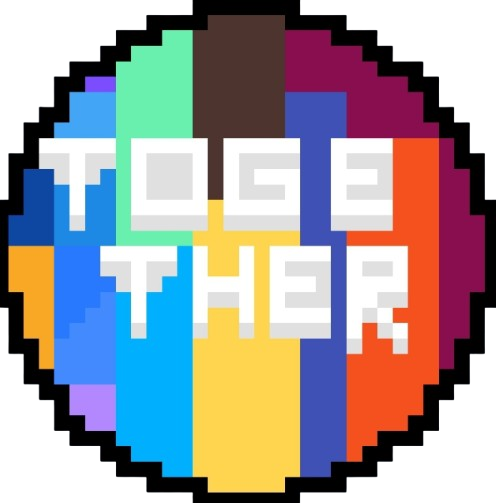

******
# Together



**Together**is a Programming Language project,where it aims to connect "grouplets",aka,groups of code,that work **together**.
Example Hello World Program:
```
a = action(Grouplet)
r = runner(Grouplet)
Process(Grouplet: a) {
  ++start
  log("Hello World!")
  --end
}
Process(Grouplet: r) {
  ++start
  /run/ = @grouplets = action, storage;functions = log(), Process(), Connect()@
  run(/run/)
  --end
}
Connect(Grouplet1: a, Grouplet2: r)
```
result:
```
Hello World!
```
Syntax and grammar can be found in the ``info`` folder.
# Why Together?
Together has high customizabillity,making conditions optional and both a lengthy mode,and a fast mode.
Together is inspired by little things from MULTIPLE languages,like shapes being maps from Go lang,implementing being from Python,Fast Mode from Javascript,and many,many more.\
Ever wanted to make code,but only test pieces of it?With run lists,we got you!\
Ever wanted to have the option to make variables and lsits local or global,chose by you?we got you!\
Ever wanted a language that has symbols around all types to be impossible to not distinguish them?We got you!\
Ever wanted a language that can have some literal single storing unit be a entire database?With shapes,we got you!\
And there is so many more reasons!\
You might think,"What's the benefit?" "Why Together?",well,you will have to find out!\
Remember:
> Don't judge a book by it's cover.

******
# PLEASE READ!!!
Together's Documentation and source code was all reset because of an burnout i had trying to finally make the parser.
Right now,Together's Source Code will be split into 4 parts:
  * Together Fast:Similar syntax and behavior to high-level languages like Javascript or Python. Made mainly for learning the hangs of programming programming languages.
  * Together Branch:Introduces grouplets and more customizabillity,kinda similar to a more complex language like Cpp or Java. Made mainly for learning how to make its standing-out syntax,and get more complex.
  * Together Tree:Introduces even more features and extra stuff,including Shapes. Made for actually distributing it and making it get used.
  * Together Merged:Introduces both Normal mode and Fast mode,having everything from previous versions. This is gonna be the big release.

These will all be made in the order they are listed.\
People are free to suggest features,help me or just support me.
******


